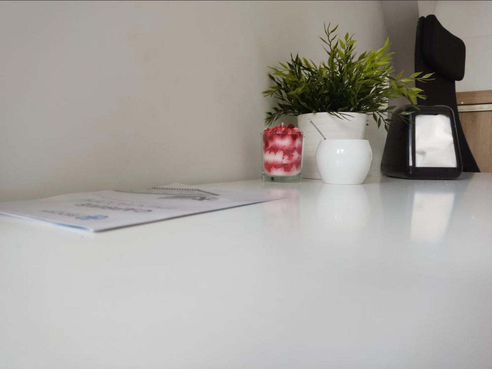
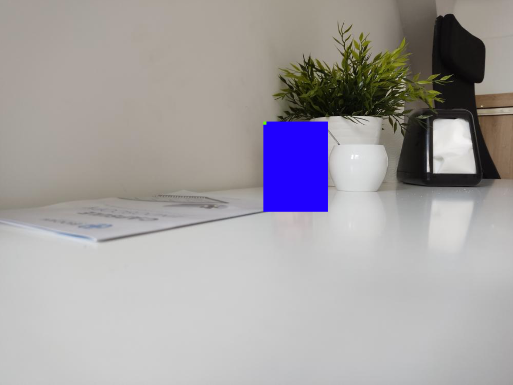
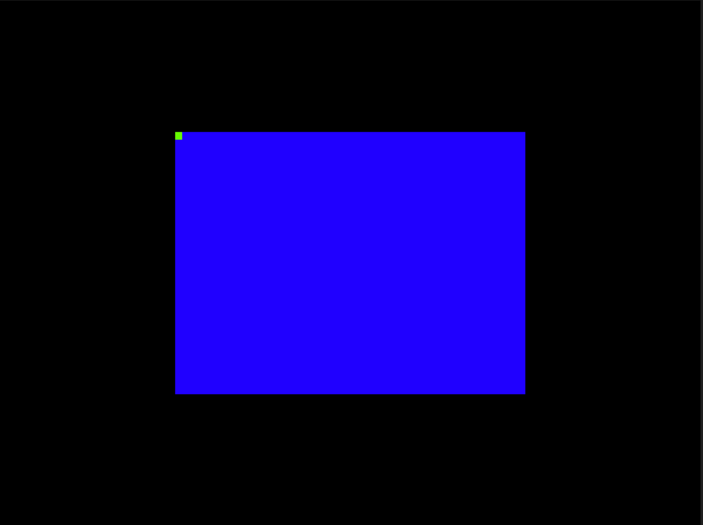
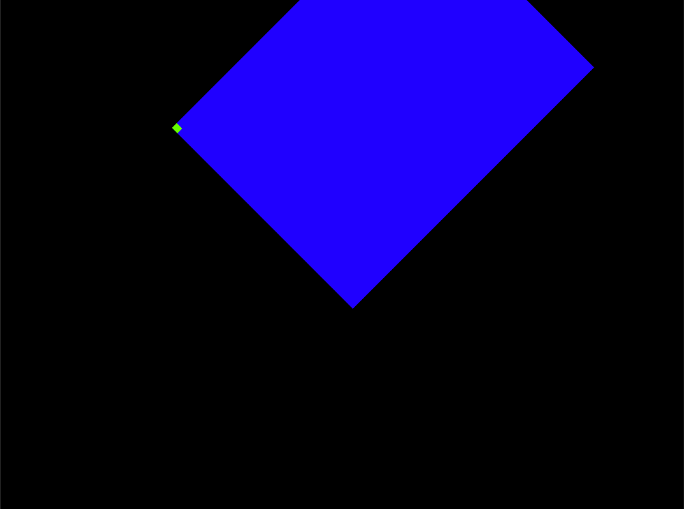

# ImagePyramid documentation


## ImagePyramid

ImagePyramid class makes it easy to work with images stored as a tile pyramid, like [Deep Zoom Image](https://learn.microsoft.com/en-us/previous-versions/windows/silverlight/dotnet-windows-silverlight/cc645077(v=vs.95)) format. It allows you to download the either the entire image or some smaller regions with an arbitrary scale, fetching only the tiles which are required and scaling the tiles automatically.

### Example code:

```python 
from histpat_toolkit.image_pyramid import ImagePyramid
from histpat_toolkit.geom import Rectangle

pyramid = ImagePyramid(
  levels=14,
  width=8000,
  height=6000,
  tile_size=512,
  tiles_url="https://example.com/path/{level}/{x}_{y}.jpeg"
)
scale = 1/2
region_of_interest = Rectangle(4100, 1900, 1000, 1200).scale(scale)
arr = pyramid.crop_rect(region_of_interest, scale=scale)

# Example: save to file with OpenCV
import cv2
img = cv2.cvtColor(arr, cv2.COLOR_RGB2BGR)
cv2.imwrite("example.jpg", img)
```

## ImagePyramid class reference

### __init__

`__init__(self, levels: int, width: int, height: int, tile_size: int, tiles_url: str) -> None:`** **

This method is run every time we instantiate object of the ImagePyramid class.

| **Parameter** | **Mandatory** | **Description**                                                                                                                                                                                | **Default value** |
| ------------- | ------------- | ---------------------------------------------------------------------------------------------------------------------------------------------------------------------------------------------- | ----------------- |
| `levels`      | Yes           | Number of levels of resolutions. The last level should contain the full size image.                                                                                                            |                   |
| `width`       | Yes           | Width (in pixels) of the image at the level with highest resolution                                                                                                                            |                   |
| `height`      | Yes           | Height (in pixels) of the image at the level with highest resolution                                                                                                                           |                   |
| `tile_size`   | Yes           | The size of a individual tile.                                                                                                                                                                 |                   |
| `tiles_url`   | Yes           | URL of form `https://example.com/path/{level}/{x}_{y}.jpeg`, that is used to download image tiles. `{level}` , `{x}` , `{y}` are placeholders which will be replaced with their actual values. |                   |

### **full_image**

`full_image(self, scale: float = 1.0) -> np.ndarray:`

This module downloads the entire image with a given scale and outputs it in the form of np.ndarray.

| **Parameter** | **Mandatory** | **Description**                                                                          | **Default value** |
| ------------- | ------------- | ---------------------------------------------------------------------------------------- | ----------------- |
| `scale`       | No            | The scale by which we multiply the dimensions of the original image (rounded downwards)  | `1.0`             |

##### example:

```python 
pyramid = ImagePyramid(14, 8000, 6000, 512, "http://0.0.0.0:8000/plant_files/{level}/{x}_{y}.jpeg")
arr = pyramid.full_image(scale=1/8)
print(arr.shape)
```

output: `(750, 1000, 3)` (height, width and number of channels of the image)

After displaying the array we get:




### crop_rect

`crop_rect(self, rect: Rectangle, scale: float = 1.0, allow_out_of_bounds: bool = False) -> np.ndarray:`

This module allows for downloading only the rectangular part of the image with a given scale. We first scale the original image and only then extract the rectangle corresponding to `rect` (with sides lengths cropped to downscale to integers).

| **Parameter**         | **Mandatory** | **Description**                                                                                                                 | **Default value** |
| --------------------- | ------------- | ------------------------------------------------------------------------------------------------------------------------------- | ----------------- |
| `rect`                | Yes           | Instance of the `Rectangle` class from the `geom` module.                                                                       |                   |
| `scale`               | No            | The scale by which we multiply the dimensions of the original image (rounded downwards)                                         | `1.0`             |
| `allow_out_of_bounds` | No            | If this is set to `False` then assertion will fail when trying to download rectangle that has some points outside of the image. | `False`           |

##### **example:**

Sometimes we would like to focus only on some part of the image. To do so, we must locate the rectangle to zoom in (this is the tricky part that has to be done manually). Let us say we want to focus on the glass from the above image. Since original resolution is `8000x6000` we will use the `Rectangle(4100, 1900, 1000, 1200)` to cover the glass.


```python 
pyramid = ImagePyramid(14, 8000, 6000, 512, "http://0.0.0.0:8000/plant_files/{level}/{x}_{y}.jpeg")
scale = 1/2
arr = pyramid.crop_rect(Rectangle(4100, 1900, 1000, 1200).scale(scale), scale=scale)
```


Thanks to the possibility of zooming we now see that delicious dessert turned out to be just a candle!


## Rectangle class

This class stores the information about the rectangle.

#### fields

(passed to the constructor in the following order)

- **x:** x-coordinate of upper-left corner of the image

- **y:** y-coordinate of upper-left corner of the image

- **w:** width of the rectangle

- **h:** height of the rectangle

**rot:** the rotation of the rectangle, counter-clockwise around the upper-left corner, in radians (rot is 0 by default)

#### **methods:**

`scale(self, scale: float):` - returns the Rectangle with all fields except for `rot` multiplied by the scale factor

`translate(self, dx: float, dy: float):`

`points(self) -> np.ndarray:` - returns the array of four points of the rectangle (from upper-left, in clockwise order)

`translate(self, dx: float, dy: float):`

`area(self):`

##### example:

`from histpat_toolkit.geom import Rectangle`

The black boundary has size `1000x750`. Upper-left corner of the `Rectangle(250, 187.5, 500, 375)` is marked with the green color.


If we now rotate the rectangle by 45 degrees (`Rectangle(250, 187.5, 500, 375, np.deg2rad(45))`), we obtain the following image. Note that the corner stays at exactly the same location.




